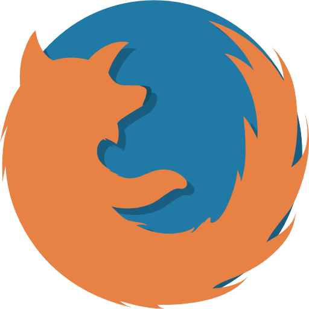

# Compatibility

<table data-header-hidden><thead><tr><th width="122"></th><th width="120"></th><th width="121.33333333333331"></th><th width="120"></th><th width="118"></th><th width="139"></th><th width="136"></th><th data-hidden></th></tr></thead><tbody><tr><td>  Native   Mobile  </td><td>   Android                4.4+</td><td>      Apple                    8.3+</td><td></td><td></td><td></td><td></td><td></td></tr><tr><td>   Mobile   Browser  </td><td>   Android    Chrome           56</td><td>    Android      Firefox            50</td><td>    Android      Opera           47</td><td>      iOS     Safari           11</td><td>         iOS       Chrome     iOS WebRTC  Bug Prevents  Compatibility</td><td>        iOS      Firefox     iOS WebRTC Bug Prevents Compatibility</td><td></td></tr><tr><td> Desktop  Browser   </td><td>   Chrome           56</td><td>     Firefox            50</td><td>     Opera            47</td><td>    Safari            11</td><td>         Edge                17</td><td>     Internet      Explorer        Planned     Support</td><td></td></tr></tbody></table>

