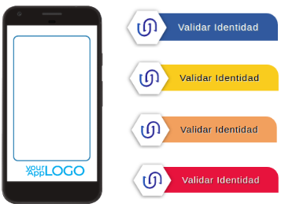
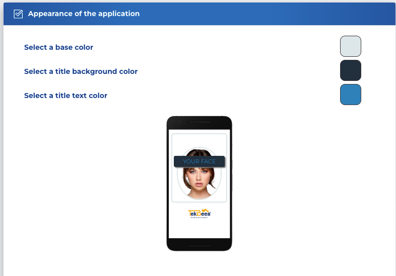

# Appearance configuration

### How to configure and/or customize the Web SDK? :pencil2:&#x20;

When you log in to the [administration panel](https://app.idunicus.com) you will find the tab called **Company**. There you can select it and set the main colors that will be used in the SDK along with the company logo. These changes will be reflected _**automatically**_ after you save your changes.

### How to give the desired look and feel to the entire verification flow?

Changing the look and feel of your verification flow is easy with our intuitive and user-friendly interface.

<figure><figcaption></figcaption></figure>
