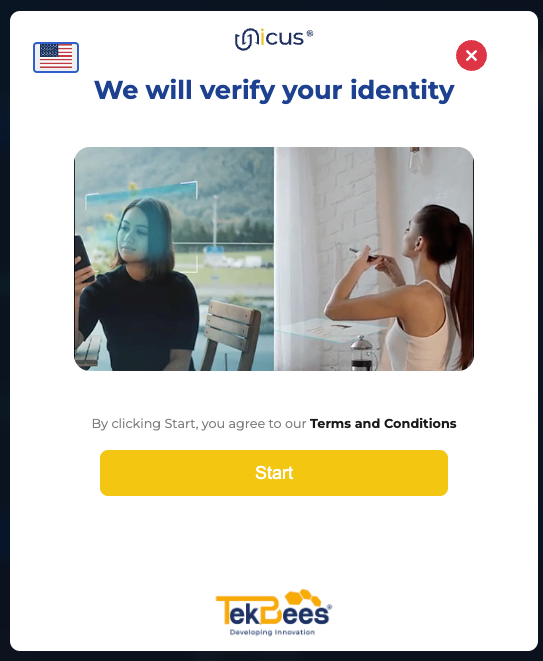
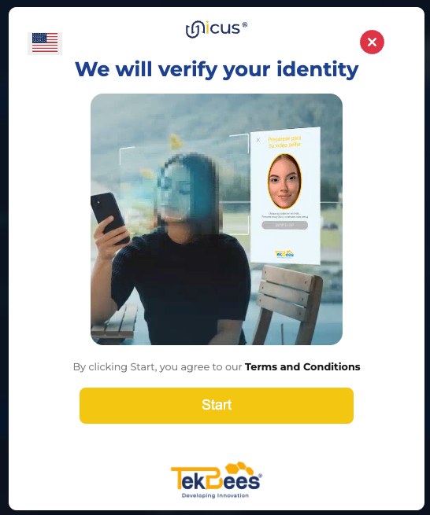

# Unicus WEB SDK

<figure><figcaption></figcaption></figure>

## Unicus Button Integration

For the integration of the _**Unicus**_ button, we have two main processes **Enrollment - Verify** and **Liveness** which you should take into account, depending on your business needs.

### How to use it?

Add the following line of code inside the header or head tag of your website.


**Important**

It is recommended to include the script with the **async** or **defer** attribute to improve page loading.



```javascript
<script 
    type="text/javascript" 
    src="https://unicusbtn.idunicus.com/sdkButton.js">
</script>
```


#### **Enrollment - Verify**

Process that unifies facial recognition with the identity document, to validate the identity of a person. When the person has already enrolled (_registered_) in the platform, only his or her face will be requested in the following transactions, verification process.

<figure><figcaption></figcaption></figure>

If you want to integrate the **Enrollment-Verify** process you need to specify three attributes, the first one is [`customertoken`](how-to-get-customer-token.md) with the value of your generated token, the second one is `transactiontype` with enrollment-verify and the third attribute `clientid` with the user identifier (Passport, Driver License, ID, etc.)


```html
<!-- @param {clientid} document type : customer's document number-->
<!-- @param {customerid} you get it from the administration panel -->
<!-- @param {transactiontype} Transaction type -->
<unicus-btn 
    clientid="<document_id>:<client_id>" 
    transactiontype="enrollment-verify" 
    customerid="<customertoken>">
</unicus-btn>
```


The valid document types are:

1. ID: National ID document
2. PP: Passport
3. DL: Driver's license
4. FD: Foreign document

#### **Liveness**

A process that applies facial recognition to identify that a user is a real person.

<div align="center" data-with-frame="true"><figure><figcaption></figcaption></figure></div>


* If you want to integrate the **Liveness** process, you need to specify two attributes, the first one is [`customertoken`](how-to-get-customer-token.md) with the value of your token generated in the [admin panel](https://app.idunicus.com) and the second is `transactiontype` with _liveness_ like the following example
* ```html
  <!-- @param {customertoken} you get it in your administration panel -->
  <!-- @param {transactiontype} Transaction type -->
  <unicus-btn 
      transactiontype="liveness" 
      customerid="<customertoken>">
  </unicus-btn>
  ```


### Unicus Button Attributes

The following is a list of the attributes of the button that will allow a better understanding of its use.

<table><thead><tr><th width="169">Attribute</th><th width="106">Type</th><th width="211">Description</th><th>Required</th></tr></thead><tbody><tr><td><strong>customertoken</strong></td><td>string</td><td>The corporate identification token</td><td><strong>mandatory</strong></td></tr><tr><td><strong>transactiontype</strong></td><td>string</td><td><p>Type of transaction to be executed:</p><ul><li>liveness</li><li>enrollment-verify</li></ul></td><td><strong>mandatory</strong></td></tr><tr><td><strong>clientid</strong></td><td>string</td><td>User identification consists of the type of identification and its identification number &#x3C;DOCUMENT_ID>:&#x3C;CLIENT_ID>. This attribute is used for <code>enrollment-verify</code> transactions.</td><td><strong>mandatory for enrollment-verify transaction</strong></td></tr><tr><td><strong>language</strong></td><td>string</td><td>interface language according to the user;'s browser</td><td><em>automatic</em></td></tr><tr><td><strong>color</strong></td><td>string</td><td>colors configured in the admin portal</td><td><em>automatic</em></td></tr><tr><td><strong>disabled</strong></td><td>string</td><td>according to the button context</td><td><em>automatic</em></td></tr></tbody></table>

### Javascript Frameworks integration

In this section you will find different implementations with the main web technologies. To use the examples it is necessary to replace the token



Implement it on your own website with just a few lines of code regardless of the framework.

Example of the complete code and its integration in the following [_link_](https://codesandbox.io/s/unicus-web-demo-yz9k4q?file=/index.html)



Example of the complete code and its integration in the following [_**link**_](https://codesandbox.io/s/unicus-react-demo-e9u6rj?file=/src/App.js)



Remember that, for the correct installation in Vue.js you must place the following line of code, this, because we are using custom elements. In this way, it will not cause warning for the use of a component not imported from npm modules.

```javascript
Vue.config.ignoredElements = ["unicus-btn"];
```

Example of the complete code and its integration in the following [_**link**_](https://codesandbox.io/s/vue-demo-unicus-forked-yf0x7b?file=/src/App.vue)



Remember that, for its correct installation in Angular you must place the following line of code, this, because we are using custom elements. In this way, it will not cause warning for the use of a component not imported from npm modules.


**Important:**\
Use _**CUSTOM\_ELEMENTS\_SCHEMA**_ importing it from @angular/core


```typescript
// app.module.ts
import { ..., CUSTOM_ELEMENTS_SCHEMA } from '@angular/core';

@NgModule({
  declarations: [
    ...,
    ...
  ],
  imports: [
    ...
  ],
  providers: [],
  bootstrap: [...],
  schemas: [ CUSTOM_ELEMENTS_SCHEMA ]
})
```

Example of the complete code and its integration in the following [_**link**_](https://codesandbox.io/s/unicus-angular-demo-hgrgws)


